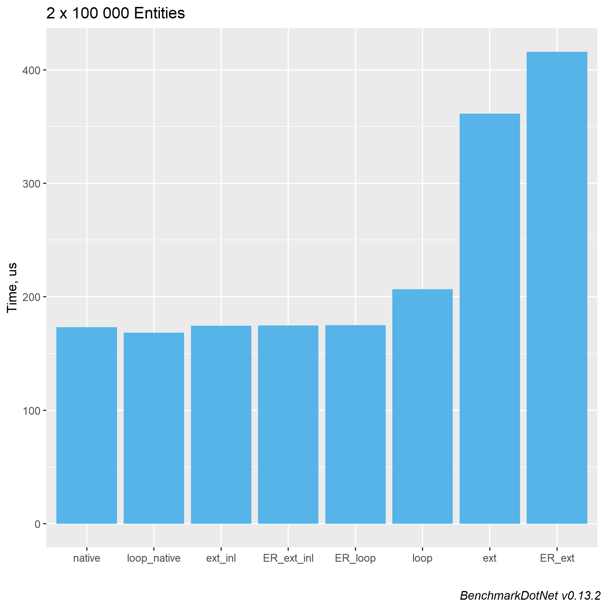

# EntitiesDotNet

A [fast](#performance) and ergonomic general purpose Entity Component System library for .NET
inspired
by [Unity Entities](https://docs.unity3d.com/Packages/com.unity.entities@1.0/manual/index.html).

> **Warning**: This is an experimental project and it is not ready for production use.

- [ECS concepts](#ecs-concepts)
    - [Entity](#entity)
    - [Component](#component)
    - [System](#system)
- [EntitiesDotNet types](#entitiesdotnet-types)
    - [EntityId](#entityid)
    - [IComponentArray](#icomponentarray)
    - [EntityArrays](#entityarrays)
    - [EntityManager](#entitymanager)
    - [Entity](#entity)
- [Iterating over components](#iterating-over-components)
    - [foreach loop](#foreach-loop)
    - [foreach loop with unmanaged function call](#foreach-loop-with-unmanaged-function-call)
    - [ForEach extensions](#foreach-extensions)
    - [ForEach extensions inlining](#foreach-extensions-inlining)
- [Iterating over components using EntityRef](#iterating-over-components-using-entityref)
    - [foreach loop](#foreach-loop)
    - [ForEach extensions](#foreach-extensions-1)
    - [ForEach extensions inlining](#foreach-extensions-inlining-1)
- [Inlining source generator](#inlining-source-generator)
- [Performance](#performance)

## ECS concepts

ECS stands for Entity Component System.

### Entity

Entities in ECS are basic units. They are similar to objects in OOP, but unlike objects entities do
not store any values themselves. Values are stored in components that are layed out in parallel
arrays for efficient processing of components of the same type. Entity is just a lightweight key
that is used to identify a position of components in the arrays.

### Component

Components are what holds the data. They are stored in parallel arrays and can be efficiently
processed sequentially or accessed randomly using [Entity](#entity) as a key.

### System

Any function that manipulates entities.

## EntitiesDotNet types

### EntityId

Structure that represents an Entity and used as a key to index entity's components
by [`EntityManager`](#entitymanager).

```c#
public readonly record struct EntityId(int Id, int Version);
```

### Archetype

A combination of component types. Every unique combination is represented by a single instance
of `Archetype` class.

```c#
var archetype0 = Archetype<Translation, Velocity, Acceleration>.Instance;
var archetype1 = Archetype.Instance<Translation, Velocity, Acceleration>();

Assert.IsTrue(object.ReferenceEquals(archetype0, archetype1));
```

### IComponentArray

Parallel arrays of components.

```c#
void UpdateTranslation(IComponentArray components, float deltaTime)
{
    if (!components.Archetype.Contains<Velocity, Translation>()) return;

    int count = components.Count;
    ReadOnlySpan<Velocity> velocities = components.GetReadOnlySpan<Velocity>();
    Span<Translation> translations = components.GetSpan<Translation>();
    
    for (var i = 0; i < count; ++i)
    {
        translations[i] += velocities[i] * deltaTime;
    }
}
```

Equivalent method using [Read/Write.From](#foreach-loop):

```c#
void UpdateTranslation(IComponentArray components, float deltaTime)
{
    var (count, velocities, translations) = Read<Velocity>.Write<Translation>.From(components);
    for (var i = 0; i < count; ++i)
    {
        translations[i] += velocities[i] * deltaTime;
    }
}
```

### EntityArrays

A collection of `IComponentArray` component arrays.

```c#
void UpdateTranslation(EntityArrays entities, float deltaTime)
{
	entities.ForEach((in Velocity velocity, ref Translation translation) =>
		translation += velocity * deltaTime);
}
```

### EntityManager

Creates and destroys entities, stores entity components.

Components are stored in a dictionary of `IComponentArray` indexed by `Archetype`.
Property `Entities` returns [`EntityArrays`](#entityarrays) collection that holds all entities'
components owned by the `EntityManager`.

```c#
var entityManager = new EntityManager();

// create entity with Velocity and translation components
var entity0 = entityManager.CreateEntity(Archetype<Velocity, Translation>.Instance);

// create entity with Velocity and Translation components and set their values
var entity1 = entityManager.CreateEntity(new Velocity(10), new Translation(0));

// update translation
var deltaTime = 1f / 60f;
entityManager.Entities.ForEach((in Velocity velocity, ref Translation translation) =>
	translation += velocity * deltaTime);
```

### Entity

Convenience structure, that contains `EntityId` and `EntityManager` and provides access to
components.

```c#
public readonly record struct Entity : IDisposable
{
    public Entity(EntityManager entityManager, EntityId id);
    
    public readonly EntityId Id;
    public readonly EntityManager EntityManager;
    public ref T RefRW<T>();            // mutable component reference
    public ref readonly T RefRO<T>();   // read-only component reference
    public void Dispose();              // Destroys entity
}
```

## Iterating over components

All of the examples below declare a component system as a static class `UpdateTranslationSystem`
with a method `Execute(EntityArrays entityArrays, float deltaTime)` that for every entity
in `EntityArrays` having `Velocity` and `Translation` components reads `Velocity` and
updates `Translation`.

```c#
static class UpdateTranslationSystem
{
    public static void Execute(EntityArrays arrays, float deltaTime);
}
```

### foreach loop

`Read<TR0, TR1, ...>.Write<TW0, TW1, ...>.From()` method can be used to access spans of
components (`Span<T>` or `ReadOnlySpan<T>`) from `EntityArrays` and `IComponentArray`. The result
can be deconstructed into a count of elements followed by spans of the specified components.

```c#
static class UpdateTranslationSystem
{
    public static void Execute(EntityArrays entities, float deltaTime)
    {
        foreach (var (count, velocities, translations) in
            Read<Velocity>.Write<Translation>.From(entities))
        {
            // velocities : ReadOnlySpan<Velocity>
            // translations : Span<Translation>
            
            for (var i = 0; i < count; ++i)
            {
                translations[i] += velocities[i] * deltaTime;
            }
        }
    }
}
```

Or

```c#
static class UpdateTranslationSystem
{
    public void Excecute(EntityArrays entities, float deltaTime)
    {
        foreach (IComponentArray components in entities)
        {
            var (count, v, t) = Read<Velocity>.Write<Translation>.From(components);
            // velocities : ReadOnlySpan<Velocity>
            // translations : Span<Translation>
            
            for (var i = 0; i < count; ++i)
            {
                translations[i] += velocities[i] * deltaTime;
            }
        }
    }
}
```

### foreach loop with unmanaged function call

`Read<TR0, TR1, ...>.Write<TW0, TW1, ...>.From()` method returns spans of components that can be
passed to an unmanaged function.

```c#
static class UpdateTranslationSystem
{
    public static unsafe void loop_native(EntityArrays entities, float deltaTime)
    {
        foreach (var (count, velocities, translations) in
            Read<Velocity>.Write<Translation>.From(entities))
        {
            fixed (Velocity* velocitiesPtr = velocities)
            fixed (Translation* translationsPtr = translations)
            {
                update_translation(count, velocitiesPtr, translationsPtr, deltaTime);
            }
        }
    }
    
    [DllImport("native_library.dll")]
    private static extern void update_translation(
        int count,
        Velocity* velocities,
        Translation* translations,
        float deltaTime);
}
```

### ForEach extensions

`EntityArrays` and `IComponentArray` extension methods `ForEach` take one of
the `ForEach_RR..WW..<T0, T1, ...>` delegates to iterate over components.

```c#
namespace EntitiesDotNet.Delegates;

public delegate void Func_RW<T0, T1>(in T0 arg0, ref T1 arg1);
public delegate void Func_RW_I<T0, T1>(in T0 arg0, ref T1 arg1, int index);
```

```c#
static class UpdateTranslationSystem
{
    public static void Execute(EntityArrays entities, float deltaTime)
    {
        entities.ForEach((in Velocity v, ref Translation t) => t += v * deltaTime);
    }
}
```

### ForEach extensions inlining

`ForEach` extension method calls can be [inlined](#inlining-source-generator).

> **Info**: Inlining is the [fastest](#performance) way to iterate over components using C#.

```c#
static partial class UpdateTranslationSystem
{
    [Inline] static void _Execute(EntityArrays entities, float deltaTime)
    {
        entities.ForEach((in Velocity v, ref Translation t) => t += v * deltaTime);
    }
}
```

<details>

<summary>Generated <code>UpdateTranslationSystem.Execute</code></summary>

```c#
#define SOURCEGEN
#pragma warning disable CS0105 // disables warning about using the same namespaces several times

using EntitiesDotNet;

static partial class UpdateTranslationSystem
{
    [EntitiesDotNet.GeneratedFrom(nameof(_Execute))]
    public static void Execute(EntityArrays entities, float deltaTime)
    {
        {
            var @this = entities;
            foreach (var __array in @this)
            {
                if (__array.Count == 0 || !__array.Archetype.Contains<Velocity, Translation>())
                {
                    continue;
                }

                var __count = __array.Count;
                ref var v = ref System.Runtime.InteropServices.MemoryMarshal.GetReference(__array.GetSpan<Velocity>());
                ref var t = ref System.Runtime.InteropServices.MemoryMarshal.GetReference(__array.GetSpan<Translation>());
                for (var __i = 0; __i < __count; v = ref System.Runtime.CompilerServices.Unsafe.Add(ref v, 1), t = ref System.Runtime.CompilerServices.Unsafe.Add(ref t, 1), ++__i)
                {
                    t += v * deltaTime;
                }
            }
        }
    }
}
#pragma warning restore CS0104
```

</details>

## Iterating over components using EntityRef

.NET 7 introduced
[ref fields](https://learn.microsoft.com/en-us/dotnet/csharp/language-reference/keywords/ref#ref-fields)
that can be used to reference entity's components.

> **Warning**: `ref fields` are not supported for runtime targets lower than .NET 7.

Create a `ref partial struct` with `EntityRef` attribute containing mutable `ref` fields of
component types (`ref` itself can be readonly but the field must be mutable). The struct must be
public or internal to support [`ForEach` extension methods](#foreach-extensions-1)
for `EntityArrays` and `IComponentArray`.

```c#
static partial class UpdateTranslationSystem
{
    [EntityRef]
    public ref partial struct ThisEntity
    {
        public ref Translation Translation;
        public ref readonly Velocity Velocity;   // mutable field, readonly reference
    }
}
```

## foreach loop

EntityRef generator creates static methods `From(EntityArrays)` and `From(IComponentArray)` that
can be used with `foreach` loop:

```c#
static partial class UpdateTranslationSystem
{
    [EntityRef]
    ref partial struct ThisEntity
    {
        public ref Translation Translation;
        public ref readonly Velocity Velocity;
    }
    
    public static void Execute(EntityArrays entities, float deltaTime)
    {
        foreach (var entity in ThisEntity.From(entities))
        {
            entity.Translation += entity.Velocity * deltaTime;
        }
    }
}
```

### ForEach extensions

If the `EntityRef` struct is public or internal, then `ForEach` extension methods for `EntityArrays`
and `IComponentArray` are generated:

```c#
static partial class UpdateTranslationSystem
{
    [EntityRef]
    public ref partial struct ThisEntity
    {
        public ref Translation Translation;
        public ref readonly Velocity Velocity;
    }

    public static void Execute(EntityArrays entities, float deltaTime)
    {
        entities.ForEach((in ThisEntity entity) =>
            entity.Translation += entity.Velocity * deltaTime);
    }
}
```

### ForEach extensions inlining

`ForEach` extension calls can be [inlined](#inlining-source-generator).

> **Info**: Inlining is the [fastest](#performance) way to iterate over components using C#.

```c#
static partial class UpdateTranslationSystem
{
    [EntityRef]
    public ref partial struct ThisEntity
    {
        public ref Translation Translation;
        public ref readonly Velocity Velocity;
    }

    [Inline] static void _Execute(EntityArrays entities, float deltaTime)
    {
        entities.ForEach((in ThisEntity entity) =>
            entity.Translation += entity.Velocity * deltaTime);
    }
}
```

<details>

<summary>Generated method <code>UpdateTranslationSystem.Execute</code></summary>

```c#
#define SOURCEGEN
#pragma warning disable CS0105 // disables warning about using the same namespaces several times

using EntitiesDotNet;

static partial class UpdateTranslationSystem
{
    [EntitiesDotNet.GeneratedFrom(nameof(_Execute))]
    public static void Execute(EntityArrays entities, float deltaTime)
    {
        {
            var @this = entities;
            UpdateTranslationSystem.ThisEntity entity = default;
            foreach (var __array in @this)
            {
                var(__count, __VelocitySpan, __TranslationSpan) = EntitiesDotNet.Read<Velocity>.Write<Translation>.From(__array);
                if (__count == 0)
                    continue;
                ref var __Velocity = ref System.Runtime.InteropServices.MemoryMarshal.GetReference(__VelocitySpan);
                ref var __Translation = ref System.Runtime.InteropServices.MemoryMarshal.GetReference(__TranslationSpan);
                for (var __i = 0; __i < __count; __Velocity = ref System.Runtime.CompilerServices.Unsafe.Add(ref __Velocity, 1), __Translation = ref System.Runtime.CompilerServices.Unsafe.Add(ref __Translation, 1), ++__i)
                {
                    entity.Velocity = ref __Velocity;
                    entity.Translation = ref __Translation;
                    entity.Translation += entity.Velocity * deltaTime;
                }
            }
        }
    }
}
#pragma warning restore CS0104
```

</details>

## Inlining source generator

`EntitiesDotNet.Generators` includes a source generator that inlines a body of lambda that is
passed to `ForEach` extension method ([for individual components](#foreach-extensions-inlining)
and [EntityRefs](#foreach-extensions-inlining-1)). The inlined methods are allocation free
and iterate over components with [near-native performance](#performance).

We will look through the following example:

```c#
static partial class InliningExample
{
    [Inline] static int _SumPositiveIntegers(EntityArrays entities)
    {
        var sum = 0;
        entities.ForEach((in int i) =>
        {
            if (i <= 0) return;
            sum += i;
        });

        return sum;
    }
}
```

Inlining generator will create a method called `SumPositiveIntegers` that will contain:

* Fast iteration over component spans from `EntityArrays`
  using [InteropServices.MemoryMarshal.GetReference](https://learn.microsoft.com/en-us/dotnet/api/system.runtime.interopservices.memorymarshal.getreference)
  and [CompilerServices.Unsafe.Add](https://learn.microsoft.com/en-us/dotnet/api/system.runtime.compilerservices.unsafe.add)
  methods from `System.Runtime` namespace.

* Inlined lambda body with `return` statement substituted for `continue`.

Generated code:

```c#
#define SOURCEGEN
#pragma warning disable CS0105 // disables warning about using the same namespaces several times

using EntitiesDotNet;

static partial class InliningExample
{
    [EntitiesDotNet.GeneratedFrom(nameof(_SumPositiveIntegers))]
    public static int SumPositiveIntegers(EntityArrays entities)
    {
        var sum = 0;
        {
            var @this = entities;
            foreach (var __array in @this)
            {
                if (__array.Count == 0 || !__array.Archetype.Contains<int>())
                {
                    continue;
                }

                var __count = __array.Count;
                ref var i = ref System.Runtime.InteropServices.MemoryMarshal.GetReference(__array.GetSpan<int>());
                for (var __i = 0; __i < __count; i = ref System.Runtime.CompilerServices.Unsafe.Add(ref i, 1), ++__i)
                {
                    {
                        if (i <= 0)
                            continue;
                        sum += i;
                    }
                }
            }
        }

        return sum;
    }
}
#pragma warning restore CS0104
```

### Requirements

For an inlined method to be generated following conditions must be met:

1) Containing type must be `partial`

   ```c#
   static partial class InliningExample
   ```

2) The original method must be marked with one of the attributes:

    * `[Inline]`
    * `[Inline.Private]`
    * `[Inline.Protected]`
    * `[Inline.Internal]`
    * `[Inline.Public]`

   These attributes take a `string? name = null` argument that defines a name for a method that will
   be generated.

    ```c#
    [Inline.Public("InlinedSumPositiveIntegers")] static int SumPositiveIntegers(EntityArrays entities)
    // Inlined method name: 'InlinedSumPositiveIntegers'
    ```

   If the attribute's argument `name` is null then the method name will be used with the following
   rule:

   If the method name starts with an underscore, then the method name without the underscore will be
   used.

    ```c#
    [Inline.Public] static int _SumPositiveIntegers(EntityArrays entities)
    // Inlined method name: 'SumPositiveIntegers'
    ```

   If the method name does not start with an underscore, then the method name with `_Inlined`
   at the end will be used.

    ```c#
    [Inline.Public] static int SumPositiveIntegers(EntityArrays entities)
    // Inlined method name: 'SumPositiveIntegers_Inlined'
    ```

## Performance

The benchmark is measuring a performance of reading `Velocity` and updating `Translation`
for `2 x N` entities.

```c#
struct float3
{
    public float X;
    public float Y;
    public float Z;
}

struct Velocity
{
    public float3 Float3;
}

struct Translation {
    public float3 Float3;
}

void UpdateTranslation(in Velocity v, ref Translation t, float deltaTime)
{
    t.Float3.X += v.Float3.X * deltaTime;
    t.Float3.Y += v.Float3.Y * deltaTime;
    t.Float3.Z += v.Float3.Z * deltaTime;
}
```

Following component systems are included in the benchmark:

* `native` - uses native C++ arrays
* `loop_native` - uses [foreach loop that calls unmanaged C++ function](#foreach-loop-with-unmanaged-function-call)
* `loop` - uses [foreach loop](#foreach-loop)
* `ext` - uses [`ForEach extensions`](#foreach-extensions)
* `ext_inl` - uses [`inlined ForEach extensions`](#foreach-extensions-inlining)
* `ER_loop` - uses [EntityRef's](#iterating-over-components-using-entityref)
  [foreach loop](#foreach-loop-1)
* `ER_ext` - uses [EntityRef's](#iterating-over-components-using-entityref)
  [`ForEach extensions`](#foreach-extensions-1)
* `ER_ext_inl` - uses [EntityRef's](#iterating-over-components-using-entityref)
  inlined [`ForEach extensions`](#foreach-extensions-1)

Full code: [ComponentSystems.cs](./EntitiesDotNet.Benchmarks/ComponentSystems.cs)

The results below were taken on a system:

```
BenchmarkDotNet=v0.13.2, OS=Windows 10 (10.0.19045.2728)
AMD Ryzen 5 5600U with Radeon Graphics, 1 CPU, 12 logical and 6 physical cores
.NET SDK=7.0.101
[Host]     : .NET 7.0.1 (7.0.122.56804), X64 RyuJIT AVX2
DefaultJob : .NET 7.0.1 (7.0.122.56804), X64 RyuJIT AVX2
```

### 2 x 1 000 Entities

| Method      | N    |     Mean |     Error |    StdDev | Ratio | Allocated |
|-------------|------|---------:|----------:|----------:|------:|----------:|
| native      | 1000 | 1.594 μs | 0.0084 μs | 0.0074 μs |  1.00 |         - |
| loop_native | 1000 | 1.847 μs | 0.0039 μs | 0.0035 μs |  1.16 |         - |
| ext_inl     | 1000 | 1.905 μs | 0.0184 μs | 0.0163 μs |  1.20 |         - |
| ER_ext_inl  | 1000 | 1.902 μs | 0.0112 μs | 0.0105 μs |  1.19 |         - |
| loop        | 1000 | 2.201 μs | 0.0217 μs | 0.0182 μs |  1.38 |         - |
| ext         | 1000 | 3.761 μs | 0.0453 μs | 0.0378 μs |  2.36 |     120 B |
| ER_ext      | 1000 | 4.720 μs | 0.0464 μs | 0.0411 μs |  2.96 |     120 B |
| ER_loop     | 1000 | 6.211 μs | 0.0675 μs | 0.0527 μs |  3.90 |         - |


### 2 x 100 000 Entities

| Method      | N      |     Mean |   Error |  StdDev | Ratio | Allocated |
|-------------|--------|---------:|--------:|--------:|------:|----------:|
| native      | 100000 | 169.3 μs | 0.51 μs | 0.48 μs |  1.00 |         - |
| loop_native | 100000 | 164.5 μs | 0.37 μs | 0.33 μs |  0.97 |         - |
| ext_inl     | 100000 | 172.0 μs | 0.46 μs | 0.43 μs |  1.02 |         - |
| ER_ext_inl  | 100000 | 172.3 μs | 0.72 μs | 0.68 μs |  1.02 |         - |
| loop        | 100000 | 203.5 μs | 0.61 μs | 0.54 μs |  1.20 |         - |
| ext         | 100000 | 353.0 μs | 0.45 μs | 0.42 μs |  2.09 |     120 B |
| ER_ext      | 100000 | 428.3 μs | 0.28 μs | 0.24 μs |  2.53 |     120 B |
| ER_loop     | 100000 | 598.9 μs | 1.14 μs | 1.01 μs |  3.54 |         - |


